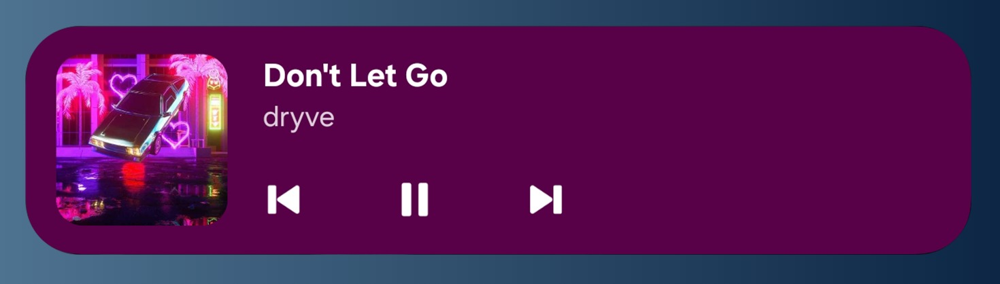
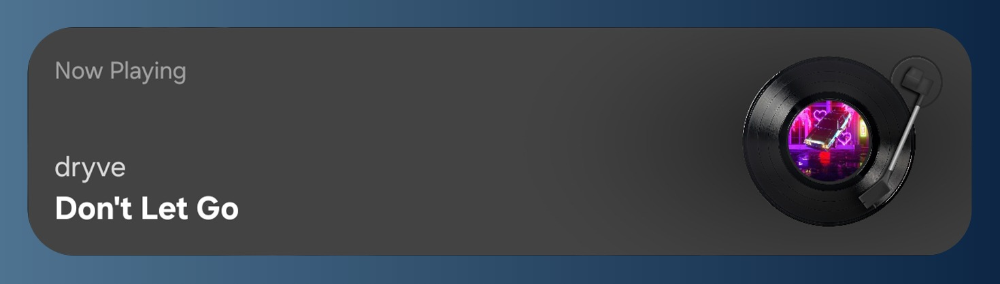
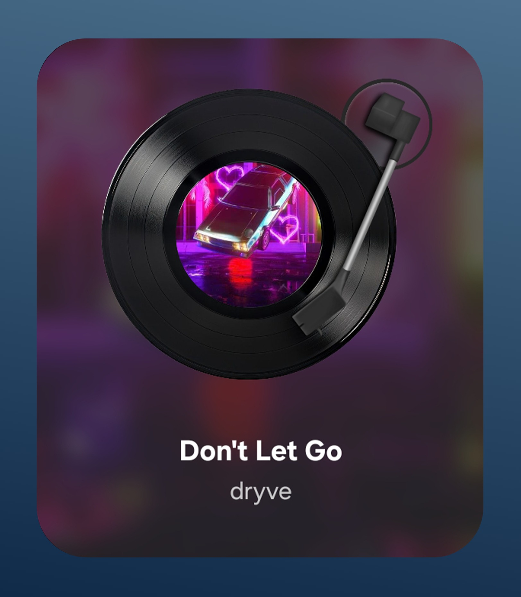

# Android Widgets

These widgets started with my astrophotography hobby and eventually expanded into other interests, like music. I’d love to keep creating widgets inspired by the things I enjoy and the hobbies I spend my time on.

## ☁️ Cloud Widget

 
Cloud widget shows the cloud cover in a set location. I love to stargaze and having a low cloud cover increases star view. I got annoyed that I always have to look out the window to check for clear skies, hence the widget.
 

## 🌙 Moon Phase Widget

 
Just thought it would be cool to have my own widget to display the Moon Phase, when it sets and rise; just so I can moon gaze. 
Besides, star gazing / astrophotography also works best during new moon, lowering the light pollution reflected by the moon

## 🎵 Music Player Widget

### 🩷 Dynamic Background

I made this because I did not like the design of the official Spotify's widget. My widget can not only control the music, but also change the background dynamically according to the album's art colours.

### 🩷 Vinyl Design

 

 
I designed this widget around the vinyl record format, inspired by my love of collecting records and the idea of bringing that physical experience into a digital space.
